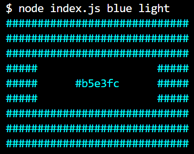

## Node.js Random Color Generator

CLI Application. Returns random colors based on user input. Possible inputs are: node index.js for random color node index.js color to specify a color and node index.js color luminosity to specify a color and luminosity.

